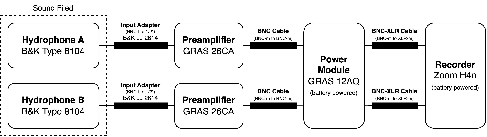
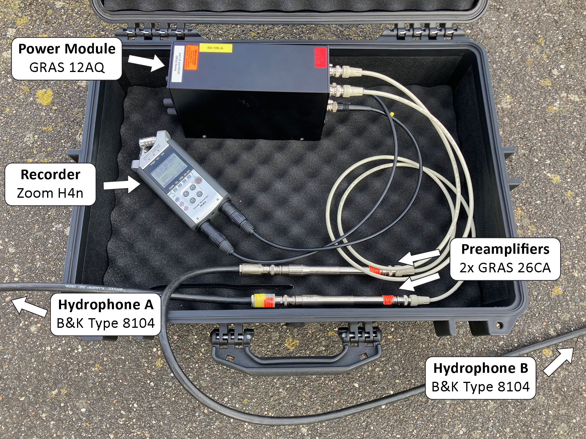

# Measurment 1 - Initial measurment

- Date: 2023-03-20
- Place: Østre Havn, Aalborg, Denmark

This was the initail measurment for the project. The goal was to test the measurment setup and to get a knowledge what environment the hydrophones would be exposed to.

In the laboratory, the hydrophones were calibrated. After the setup brought out to the port side of Østre Havn, Aalborg, Denmark. The hydrophones were placed in the water and the data was recorded. Five different jumps are recorded in this measurment and background noise was recorded for around 30 minutes.

## Setup

The measurment setup was as follows:

The hydrophones were placed on the port side. The hydrophones were placed to be 12.5 meters apart from each other and then submerged under the water at a depth of 1 meter. One of the hydrophone cables was zip-tied to the above-water part of the rescue ladder, and the 1-meter length cable and hydrophone head were hung in the water. While the other was hung from ∼2.5 meter high on the port side.

## Measurments (raw recordings)

All the recorded data can be found in the [raw](raw/) folder.

| Filename | Title | Description | Gain | Length |
|----------|-------|-------------|------|--------|
| [230320-000.wav](raw/230320-000.wav) | Calibration (laboratory) | Calibration of the hydrophone A (battery) | 30 dB, 10 dB, 0 dB | 01:25 |
| [230320-001.wav](raw/230320-001.wav) | Calibration (laboratory) | Calibration of the hydrophone B | 30 dB | 00:26 |
| [230320-002.wav](raw/230320-002.wav) | Calibration (laboratory) | Calibration of the hydrophone A | 30 dB | 00:23 |
| [230320-003.wav](raw/230320-003.wav) | Calibration (laboratory) | Calibration of the hydrophone A | 30 dB | 00:22 |
| [230320-004.wav](raw/230320-004.wav) | Calibration (laboratory) | Calibration of the hydrophone B | 30 dB | 00:22 |
| [230320-005.wav](raw/230320-005.wav) | Background noise | Background noise, rock throwing (start 10:50) | 30 dB | 02:13 |
| [230320-006.wav](raw/230320-006.wav) | Background noise | Background noise, rock throwing (start 11:02) | 0 dB | 03:31 |
| [230320-007.wav](raw/230320-007.wav) | Background noise | Background noise (start 11:10)  | 20 dB | 15:31 |
| [230320-008.wav](raw/230320-008.wav) | Jump recordings | Jump recordings (jumps at x=1m, x=5m and x=2.5m) | 0 dB | 04:48  |
| [230320-009.wav](raw/230320-009.wav) | Jump recordings | Jump recordings (jumps at x=1m, x=5m and x=2.5m) | 20 dB | 03:08 |
| [230320-010.wav](raw/230320-010.wav) | Calibration (laboratory)| Calibration of the hydrophone A | 0 dB, 20 dB, 30 dB | 00:45 |
| [230320-011.wav](raw/230320-011.wav) | Calibration (laboratory)| Calibration of the hydrophone B | 0 dB, 20 dB, 30 dB | 00:45 |
| [230320-012.wav](raw/230320-012.wav) | Hydrophone noise (laboratory)| Hydrophone noise recording in quite room | 0 dB, 20 dB, 30 dB | 00:56 |
