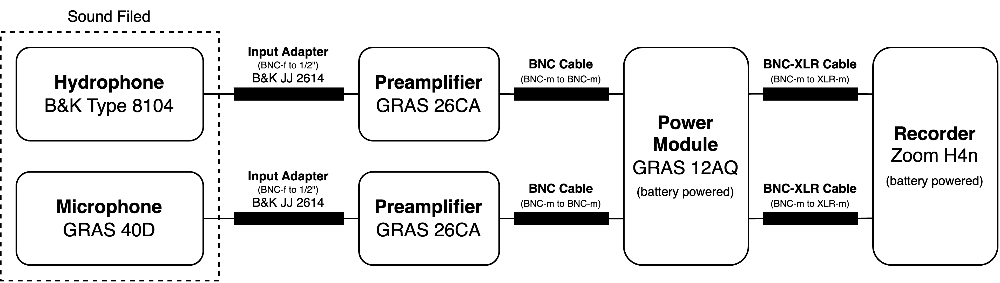
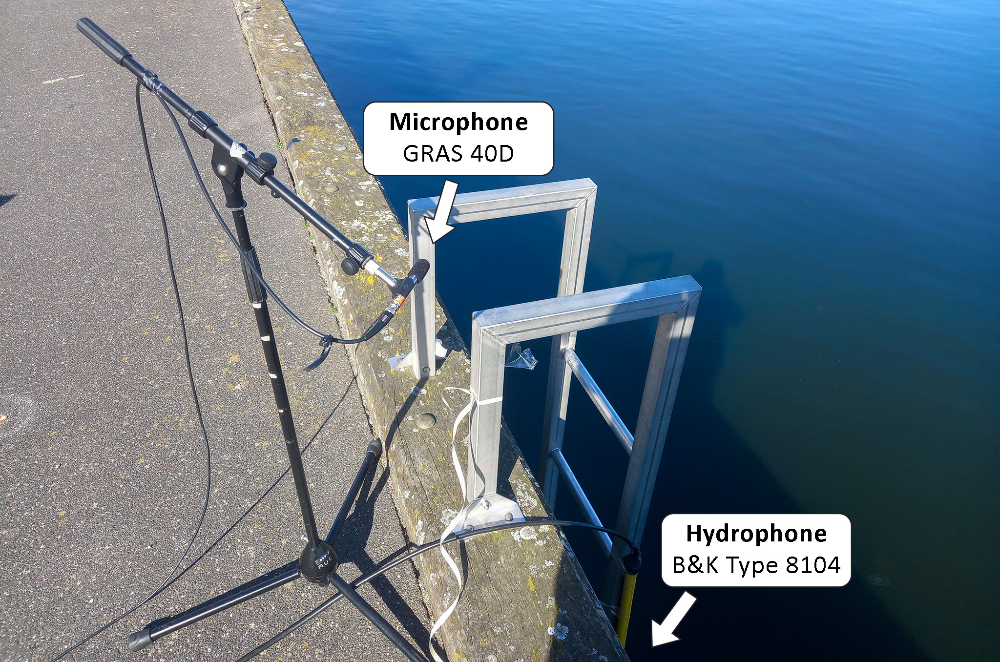

# Measurment 2 - Second measurment

- Date: 2023-04-28
- Place: Østre Havn, Aalborg, Denmark and Vestre Havnepromenade close to the Aalborg Havnefront, Aalborg, Denmark

This was the second measurment period for the project. The goal was to take jump measurments from different distances and make measurments in different environments. In this measurment period we used a new setup where one of the hydrophone replaced with a mictophone.

From the first location, we gathered 8 jumps with each jump at a different distance from the hydrophone (starting at 5 meters away and finishing at 40 meters away, in the opposite direction of the current).

We gathered 1 hour and 25 minutes from the second location of background noise and simulated sounds such as a stream dripping into the water. The hydrophone managed to capture: falls into the water, streams, seagulls landing in the water, fighting for food and chirping, different types of boats, and the rising and closing of a nearby bridge.

## Setup

The measurment setup was as follows:

The hydrophone was submerged at a depth of 1 meter into the water while the microphone was set at a height of 1 m from the ground using a stand but at a height of ~3 m above water. This was done because there was no reliable way to setup the microphone at the same height as the hydrophone's depth due to the fjord line edge.

## Measurments (raw recordings)

All the recorded data can be found in the [raw](raw/) folder.

For all the recordings, the gain was set to 20 dB for the hydrophone and 30 dB for the microphone. The calibration only happened for the hydrophone.

The left channel is the hydrophone and the right channel is the microphone.

| Filename | Title | Description | Length |
|----------|-------|-------------|--------|
| [230428-001.wav](raw/230428-001.wav) | Test recording with rocks throwing | Test recording with rocks throwing at (02:14, 02:17, 02:20) | 02:28 |
| [230428-003.wav](raw/230428-003.wav) | Jump recording | Jump recordings with 8 separate recording. Each recording is a jump at a different distance from the hydrophone (starting at 5 meters away and finishing at 40 meters away). | 26:08 |
| [230428-004.wav](raw/230428-004.wav) | Calibration | Calibration of the hydrophone | 00:20 |
| [230428-005.wav](raw/230428-005.wav) | Calibration | Calibration of the microphone | 00:14 |
| [230428-006.wav](raw/230428-006.wav) | Background noise | Background noise, stream dripping into the water, seagulls landing in the water, fighting for food and chirping, different types of boats, and the rising and closing of a nearby bridge. | 01:25:52 |
| [230428-010.wav](raw/230428-007.wav) | Calibration | Calibration of the microphone | 00:30 |
